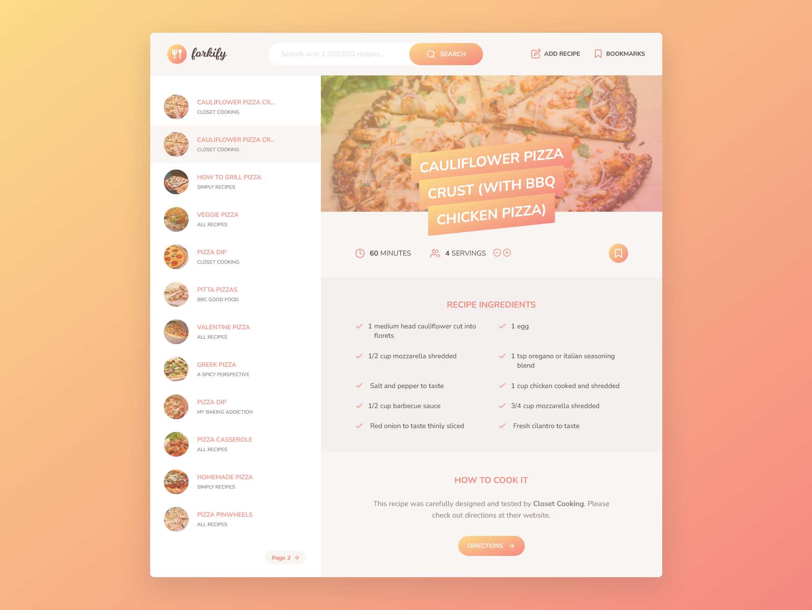

# Forkify Project

Welcome to Forkify - a small project designed to explore recipe search, bookmarking, and user recipe functionalities. This project interacts with a REST API that contains a diverse collection of recipes. You can access the live demo of Forkify [here](https://forkify-peter-nady.netlify.app/).




## Features

1. **Search Functionality:**

   - Use the input field to send requests to the API with searched keywords.
   - Display search results with pagination for better navigation.

2. **Recipe Details:**

   - View detailed information for each recipe, including cooking time, servings, and ingredients.

3. **Change Servings:**

   - Dynamically update all ingredients based on the current number of servings.

4. **Bookmarking Functionality:**

   - Maintain a list of bookmarked recipes for quick reference.
   - User-uploaded recipes are automatically bookmarked.

5. **User Uploaded Recipes:**

   - Users can upload their own recipes.
   - Users can only view and manage their own recipes, ensuring privacy.

6. **Local Storage:**
   - Store bookmark data locally in the browser using local storage.
   - On page load, retrieve saved bookmarks from local storage and display them.

## Getting Started

To run Forkify on your machine, follow these steps:

1. Clone the repository to your local machine.

   ```bash
   git clone https://github.com/your-username/forkify.git
   ```

2. Navigate to the project directory.

   ```bash
   cd forkify
   ```

3. Install the required packages.

   ```bash
   npm install
   ```

4. Start the application.
   ```bash
   npm start
   ```

Now you should be able to access Forkify on your local machine by navigating to [http://localhost:1234](http://localhost:1234) in your web browser.

Feel free to explore, search for recipes, bookmark your favorites, and even upload your own recipes!

## API Information

Forkify communicates with a REST API to fetch recipe data. The API is hosted at [https://forkify-api.herokuapp.com/v2](https://forkify-api.herokuapp.com/v2). Check the API documentation for more details.

## Feedback and Contributions

If you have any feedback, suggestions, or would like to contribute to Forkify, please open an issue or submit a pull request on the [GitHub repository](https://github.com/peternadykamal/forkify).
